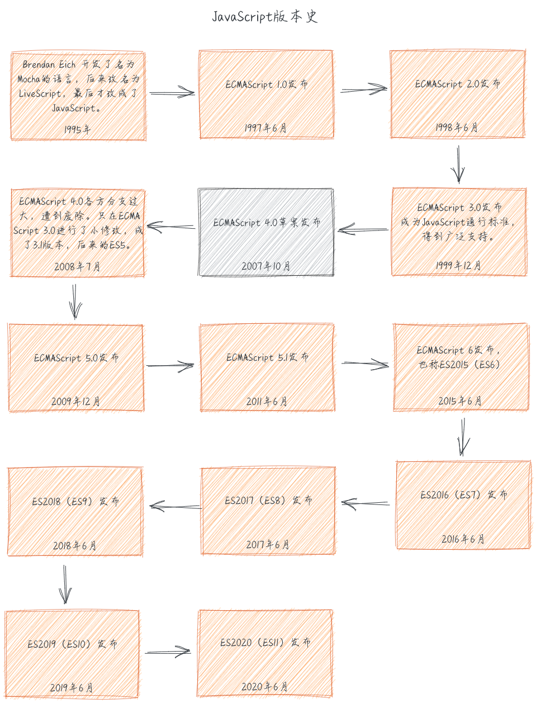
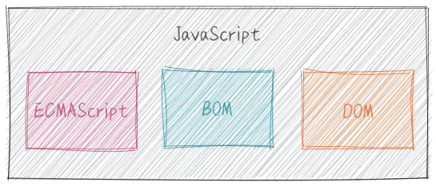

# 1. 什么是 JavaScript

## JavaScript 历史

### 有趣的开端

据说 Brendan Eich 最初是希望以 Scheme 语言（函数式语言鼻祖 LISP 语言的一种方言）为蓝本，实现这种新语言，10 天后它问世了，这门新出现的语言语法是个大杂烩：

- `基本语法`：借鉴 C 语言和 Java 语言。
- `数据结构`：借鉴 Java 语言，包括将值分成原始值和对象两大类。
- `函数的用法`：借鉴 Scheme 语言和 Awk 语言，将函数当作第一等公民，并引入闭包。
- `原型继承模型`：借鉴 Self 语言（Smalltalk 的一种变种）。
- `正则表达式`：借鉴 Perl 语言。
- `字符串和数组处理`：借鉴 Python 语言。

### 平稳的推进

## JavaScript 的组成

在未系统性学习 JavaScript 之前，我一直搞不清 JavaScript、ECMAScript、DOM 和 BOM 之间的关系，而现在我会告诉你他们的关系是这样的：

### ECMAScript

`ECMAScript`，发音/ek-ma-script/，是`ECMA-262定义的语言，并不局限于Web浏览器`，它是一个基准。

你可以在[这里 👈](https://www.ecma-international.org/publications/standards/Ecma-262.htm)看到 TC39 委员会制定的 ECMAScript 标准

### DOM

`文档对象模型`（DOM，Document Object Model）提供与网页内容交互的方法和接口。

你可以在[这里 👈](https://www.w3.org/DOM/DOMTR)看到 W3C 制定的 DOM 标准

### BOM

`浏览器对象模型`（BOM, Browser Object Model）提供与浏览器交互的方法和接口。

`BOM与DOM有所不同，它既没有标准的实现，也没有严格的定义，浏览器厂商可以自由地实现BOM。`尽管如此，MDN 还是维护了一份[共享的 JavaScript 接口](https://developer.mozilla.org/en-US/docs/Web/API)

## 参考资料

1. [JavaScript 语言的历史, by 阮一峰](https://javascript.ruanyifeng.com/introduction/history.html)
2. [ECMAScript](https://zh.wikipedia.org/wiki/ECMAScript)
